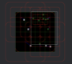

<a name="readme-top"></a>

<!--
*** This README is modified from https://github.com/othneildrew/Best-README-Template
-->

<!-- PROJECT SHIELDS -->
[![Contributors][contributors-shield]][contributors-url]
[![Forks][forks-shield]][forks-url]
[![Stargazers][stars-shield]][stars-url]
[![Issues][issues-shield]][issues-url]
[![MIT License][license-shield]][license-url]


<!-- PROJECT LOGO -->
<br />
<div align="center">
  <a href="https://github.com/kingwingfly/bevy_quadtree">
    
  </a>

<h3 align="center">bevy_quadtree</h3>

  <p align="center">
    A quadtree plugin for Bevy
    <br />
    <a href="https://github.com/kingwingfly/bevy_quadtree"><strong>Explore the docs »</strong></a>
    <br />
    <br />
    <a href="https://github.com/kingwingfly/bevy_quadtree">View Demo</a>
    ·
    <a href="https://github.com/kingwingfly/bevy_quadtree/issues/new?labels=bug&template=bug-report---.md">Report Bug</a>
    ·
    <a href="https://github.com/kingwingfly/bevy_quadtree/issues/new?labels=enhancement&template=feature-request---.md">Request Feature</a>
  </p>
</div>


<!-- TABLE OF CONTENTS -->
<details>
  <summary>Table of Contents</summary>
  <ol>
    <li>
      <a href="#about-the-project">About The Project</a>
      <ul>
        <li><a href="#built-with">Built With</a></li>
      </ul>
    </li>
    <li><a href="#usage">Usage</a></li>
    <li><a href="#roadmap">Roadmap</a></li>
    <li><a href="#contributing">Contributing</a></li>
    <li><a href="#license">License</a></li>
    <li><a href="#contact">Contact</a></li>
    <li><a href="#acknowledgments">Acknowledgments</a></li>
  </ol>
</details>


<!-- ABOUT THE PROJECT -->
## About The Project

[![Product Name Screen Shot][product-screenshot]](https://github.com/kingwingfly/bevy_quadtree)

A quadtree plugin for bevy.

Function:
- Auto update following `Changed<GlobalTransform>`, all users need to do is querying.
- LooseQuadTree supported.
- Compile time optimized with const type parameters.

Features:
- `gizmos`: show gizmos of the quadtree boundaries.
- `sprite`: enable `CollisionRect` to track `sprite.size`.

<p align="right">(<a href="#readme-top">back to top</a>)</p>


### Built With

* [![Rust][Rust]][Rust-url]
* [![Bevy][Bevy]][Bevy-url]

<p align="right">(<a href="#readme-top">back to top</a>)</p>


<!-- USAGE EXAMPLES -->
## Usage

1. Add the plugin to your `Cargo.toml`:

```toml
[dependencies]
bevy_quadtree = { version = "0.15.1" }
```

2. Add the plugin to your Bevy app:

```rust no_run
use bevy::prelude::*;
use bevy_quadtree::{QuadTreePlugin, CollisionCircle, CollisionRect};

fn main() {
    #[cfg(feature = "sprite")]
    App::new()
        .add_plugins(DefaultPlugins)
        .add_plugins(QuadTreePlugin::<(
            (CollisionCircle, GlobalTransform), (CollisionRect, Sprite), (CollisionRect, GlobalTransform)),
            40, 100, 100, 20>::default()
        )
        // CollisionCircle follows GlobalTransform, CollisionRect follows Sprite and GlobalTransform
        // at most 40 entities in a node
        // 100 x 100 world size
        // 20 / 10 = 2 = outlet_boundary / inlet_boundary (for loose quadtree)
        .run();
}
```

3. Spawn CollisionShapes as Components:

```rust ignore
// in systems
cmds.spawn((
    Sprite {
        color: Color::WHITE,
        custom_size: Some(CUSTOM_SIZE),
        ..Default::default()
    },
    // Spawn collision shape `CollisionRect` with `Sprite`,
    // the plugin will auto-update it following `Changed<GlobalTransform>` and `Changed<Sprite>`
    CollisionRect::from(Rect::from_center_size(pos, CUSTOM_SIZE)),
    Transform::from_xyz(pos.x, world_pos.y, 1.),
))
```

4. Query the quadtree like bevy's `Or, Not`:

```rust ignore
type MyQuadTree = QuadTree<40, 100, 100, 20>;

fn pick(
    mut gizmos: Gizmos,
    btn: Res<ButtonInput<MouseButton>>,
    key: Res<ButtonInput<KeyCode>>,
    quadtree: Res<MyQuadTree>,
    mut start: Local<Option<Vec2>>,
    ...
) {
    if !btn.pressed(MouseButton::Left) {
        *start = None;
        return;
    }
    let world_position = ...;
    let cancel_pick = key.any_pressed([KeyCode::ShiftLeft, KeyCode::ShiftRight]);
    match *start {
        Some(start) => {
            gizmos.rect_2d(
                (start + world_pos) / 2.,
                (start - world_pos).abs(),
                if cancel_pick { RED } else { WHITE },
            );
            let res = if start.x > world_pos.x {
                // left pick
                quadtree.query::<_, QOr<(Overlap, Contain)>>(&CollisionRect::from(
                    Rect::from_corners(start, world_pos),
                ))
            } else {
                // right pick
                quadtree
                    .query::<_, Contain>(&CollisionRect::from(Rect::from_corners(start, world_pos)))
            };
            if cancel_pick {
                ...
            } else {
                ...
            }
        }
        None => *start = Some(world_pos),
    }
}
```

5. However, you may need manually update collision shapes in some case

```rust ignore
xx.observe(
    |trigger: Trigger<TextRefreshEvent>,
     mut q_box: Query<(&mut Sprite, &mut CollisionRect)>| {
        if let Ok((mut s, mut c)) = q_box.get_mut(trigger.entity()) {
            let ev = trigger.event();
            let delta = Vec2::new(ev.width * FONT_WIDTH, (ev.height - 1.) * FONT_HEIGHT);
            s.custom_size = Some(CUSTOM_SIZE + delta);
            // the plugin default only track `Changed<GlobalTransform>`
            // without feature `sprite` enable, you can also do this way.
            c.set_init_size(CUSTOM_SIZE + delta);
        }
    },
)
```

See this repo [graph](https://github.com/kingwingfly/graph) for more complete examples.

_For more details, please refer to the [Documentation](https://docs.rs/bevy_quadtree)_

<p align="right">(<a href="#readme-top">back to top</a>)</p>


<!-- ROADMAP -->
## Roadmap

- [ ] Feature

See the [open issues](https://github.com/kingwingfly/bevy_quadtree/issues) for a full list of proposed features (and known issues).

<p align="right">(<a href="#readme-top">back to top</a>)</p>


<!-- CONTRIBUTING -->
## Contributing

Contributions are what make the open source community such an amazing place to learn, inspire, and create. Any contributions you make are **greatly appreciated**.

If you have a suggestion that would make this better, please fork the repo and create a pull request. You can also simply open an issue with the tag "enhancement".
Don't forget to give the project a star! Thanks again!

1. Fork the Project
2. Create your Feature Branch (`git checkout -b feature/AmazingFeature`)
3. Commit your Changes (`git commit -m 'Add some AmazingFeature'`)
4. Push to the Branch (`git push origin feature/AmazingFeature`)
5. Open a Pull Request

<p align="right">(<a href="#readme-top">back to top</a>)</p>


<!-- LICENSE -->
## License

Distributed under the MIT License. See `LICENSE.txt` for more information.

<p align="right">(<a href="#readme-top">back to top</a>)</p>


<!-- CONTACT -->
## Contact

Louis - 836250617@qq.com

Project Link: [https://github.com/kingwingfly/bevy_quadtree](https://github.com/kingwingfly/bevy_quadtree)

<p align="right">(<a href="#readme-top">back to top</a>)</p>


<!-- ACKNOWLEDGMENTS -->
## Acknowledgments

* []()

<p align="right">(<a href="#readme-top">back to top</a>)</p>


<!-- MARKDOWN LINKS & IMAGES -->
<!-- https://www.markdownguide.org/basic-syntax/#reference-style-links -->
[contributors-shield]: https://img.shields.io/github/contributors/kingwingfly/bevy_quadtree.svg?style=for-the-badge
[contributors-url]: https://github.com/kingwingfly/bevy_quadtree/graphs/contributors
[forks-shield]: https://img.shields.io/github/forks/kingwingfly/bevy_quadtree.svg?style=for-the-badge
[forks-url]: https://github.com/kingwingfly/bevy_quadtree/network/members
[stars-shield]: https://img.shields.io/github/stars/kingwingfly/bevy_quadtree.svg?style=for-the-badge
[stars-url]: https://github.com/kingwingfly/bevy_quadtree/stargazers
[issues-shield]: https://img.shields.io/github/issues/kingwingfly/bevy_quadtree.svg?style=for-the-badge
[issues-url]: https://github.com/kingwingfly/bevy_quadtree/issues
[license-shield]: https://img.shields.io/github/license/kingwingfly/bevy_quadtree.svg?style=for-the-badge
[license-url]: https://github.com/kingwingfly/bevy_quadtree/blob/master/LICENSE.txt
[product-screenshot]: images/log.png
[Rust]: https://img.shields.io/badge/Rust-000000?style=for-the-badge&logo=Rust&logoColor=orange
[Rust-url]: https://www.rust-lang.org
[Bevy]: https://img.shields.io/badge/Bevy-000000?style=for-the-badge&logo=Bevy&logoColor=white
[Bevy-url]: https://bevyengine.org
